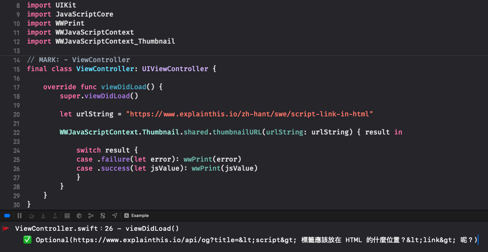

# WWJavaScriptContext+Thumbnail
[](https://developer.apple.com/swift/) [](https://developer.apple.com/swift/)  [](https://developer.apple.com/swift/) [](https://developer.apple.com/swift/)

### [Introduction - 簡介](https://swiftpackageindex.com/William-Weng)
- [Get the URL of the thumbnail of the website.](https://frankchiu.io/seo-open-graph/)
- [取得該網址的縮圖的URL。](https://www.hellosanta.com.tw/knowledge/category-39/post-411)



### [Installation with Swift Package Manager](https://medium.com/彼得潘的-swift-ios-app-開發問題解答集/使用-spm-安裝第三方套件-xcode-11-新功能-2c4ffcf85b4b)
```js
dependencies: [
    .package(url: "https://github.com/William-Weng/WWJavaScriptContext_Thumbnail.git", .upToNextMajor(from: "1.1.0"))
]
```

### Function - 可用函式
|函式|功能|
|-|-|
|thumbnailURL(urlString:using:result:)|取得該網頁的縮圖網址|
|thumbnailData(urlString:using:characterSet:result:)|取得該網頁的縮圖資料|
|thumbnail(urlString:using:characterSet:result:)|取得該網頁的縮圖|

### Example
```swift
import UIKit
import JavaScriptCore
import WWPrint
import WWJavaScriptContext
import WWJavaScriptContext_Thumbnail

final class ViewController: UIViewController {

    override func viewDidLoad() {
        super.viewDidLoad()
        
        let urlString = "https://www.explainthis.io/zh-hant/swe/script-link-in-html"
        
        WWJavaScriptContext.Thumbnail.shared.thumbnailURL(urlString: urlString) { result in
            
            switch result {
            case .failure(let error): wwPrint(error)
            case .success(let jsValue): wwPrint(jsValue)
            }
        }
    }
}
```
